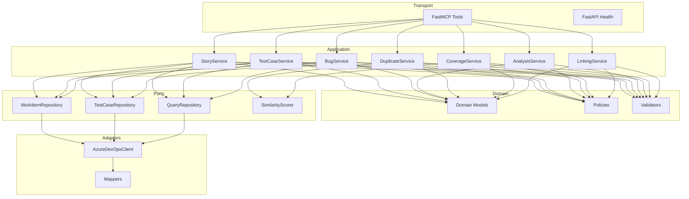

# 04 — Component Diagram

**Product:** QA Intelligence MCP Server  

---

## 1. Layered Component View

```text
┌─────────────────────────────────────────────────────────────────────────┐
│                         TRANSPORT LAYER                                  │
│  FastMCP Server (tool registration)     FastAPI Health (/health,/ready) │
│  mcp/tools/*  (thin adapters)                                            │
└───────────────────────────────────┬─────────────────────────────────────┘
                                    │
┌───────────────────────────────────▼─────────────────────────────────────┐
│                         APPLICATION LAYER                                │
│  StoryService · TestCaseService · BugService · AnalysisService           │
│  DuplicateService · CoverageService · LinkingService                     │
└─┬─────────────────────────────┬─────────────────────────────┬───────────┘
  │                             │                             │
  ▼                             ▼                             ▼
┌─────────────────┐  ┌──────────────────────┐  ┌──────────────────────────┐
│ DOMAIN MODELS   │  │ POLICIES             │  │ VALIDATION LAYER         │
│ UserStory       │  │ CategoryPolicy       │  │ TestCaseFormatValidator  │
│ TestCase        │  │ RiskPolicy           │  │ ParityValidator          │
│ Bug             │  │ GapPolicy            │  │ DuplicateBatchValidator  │
│ QAStrategy      │  │                      │  │ ExtraFieldsForbidden     │
│ CoverageReport  │  │                      │  │                          │
└─────────────────┘  └──────────────────────┘  └──────────────────────────┘
                                    │
┌───────────────────────────────────▼─────────────────────────────────────┐
│                         PORTS (PROTOCOLS)                                │
│  WorkItemRepository · TestCaseRepository · QueryRepository               │
│  AuthProvider · SimilarityScorer                                         │
└───────────────────────────────────┬─────────────────────────────────────┘
                                    │
┌───────────────────────────────────▼─────────────────────────────────────┐
│                         ADAPTERS (INFRASTRUCTURE)                        │
│  AzureDevOpsClient · PATAuth · Mappers · Settings · Structlog · DI       │
└───────────────────────────────────┬─────────────────────────────────────┘
                                    │
                                    ▼
                          Azure DevOps REST API
```

---

## 2. Component Responsibilities

| Component | Why it exists | Owns |
|-----------|---------------|------|
| MCP Tools | Protocol boundary | I/O mapping only |
| Services | Use-case orchestration | Workflow logic without HTTP/MCP details |
| Domain models | Shared language | Typed entities & value objects |
| Policies | QA intelligence rules | Category allow/deny, risk, blocking gaps |
| Validators | Quality gate | Hard rejects before write |
| Repository ports | Dependency inversion | Abstract persistence/query |
| ADO adapters | External system isolation | REST, auth, JSON mapping |
| DI container | Composition root | Wire lifetimes |
| Health API | Ops readiness | Liveness/readiness without MCP |

---

## 3. Dependency Rules (SOLID)

- Tools depend on **service interfaces / concrete services**, not ADO.  
- Services depend on **repository protocols**, not HTTP clients.  
- Domain has **zero** infrastructure imports.  
- New similarity algorithms implement `SimilarityScorer` without changing tools.  
- New auth modes implement `AuthProvider` without changing repositories.

---

## 4. Runtime Composition

```text
main.py
  → load Settings
  → configure structlog
  → build DI container (client, repos, services)
  → register FastMCP tools (inject services)
  → optionally mount FastAPI health app
  → run transport (stdio or SSE)
```

---

## 5. Mermaid Component Diagram



---

## Related

- [02-folder-structure.md](./02-folder-structure.md)  
- [08-repository-layer.md](./08-repository-layer.md)  
- [09-service-layer.md](./09-service-layer.md)  
