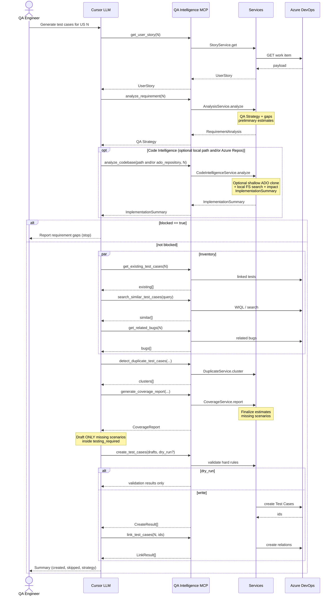

# 05 — Sequence Diagram

**Product:** QA Intelligence MCP Server  

---

## 1. Primary End-to-End Sequence

Happy path: *Generate test cases for User Story N* (gap-fill).



---

## 2. Analyze Requirement (detail)

```text
Cursor                AnalysisService           CategoryPolicy        GapPolicy
  |                         |                         |                    |
  | analyze_requirement     |                         |                    |
  |------------------------>|                         |                    |
  |                         | classify feature/risk   |                    |
  |                         |------------------------>|                    |
  |                         | required / not required |                    |
  |                         |------------------------>|                    |
  |                         | detect gaps             |-------------------->
  |                         | blocked?                |<-------------------|
  |                         | build QAStrategy        |                    |
  |<------------------------|                         |                    |
```

---

## 3. Create Test Cases (validation gate)

```text
Cursor          TestCaseService       FormatValidator      TestCaseRepository      ADO
  |                   |                     |                      |                |
  | create(drafts)    |                     |                      |                |
  |------------------>|                     |                      |                |
  |                   | validate each       |                      |                |
  |                   |-------------------->|                      |                |
  |                   | ok / errors         |                      |                |
  |                   |<--------------------|                      |                |
  |                   | if ok & !dry_run    |                      |                |
  |                   |------------------------------------------->|                |
  |                   |                                            | create WI      |
  |                   |                                            |--------------->|
  |                   |                                            |<---------------|
  | CreateResult[]    |                                            |                |
  |<------------------|                                            |                |
```

Invalid items never call ADO. Valid items proceed independently (per-item results).

---

## 4. Failure Sequences (summary)

| Failure | Sequence outcome |
|---------|------------------|
| Story not found | `ok=false`, `ADO_NOT_FOUND`; stop workflow |
| Auth failure | `ADO_AUTH_FAILED`; no retries with same bad secret |
| Blocking gaps | Analysis succeeds with `blocked=true`; no create unless override |
| Step/result mismatch | Item-level validation error; other items may still create |
| ADO 429 | Retry with backoff on reads; then `ADO_RATE_LIMITED` |

---

## Related

- [06-data-flow.md](./06-data-flow.md)  
- [12-llm-interaction-flow.md](./12-llm-interaction-flow.md)  
- [14-error-handling-strategy.md](./14-error-handling-strategy.md)  
